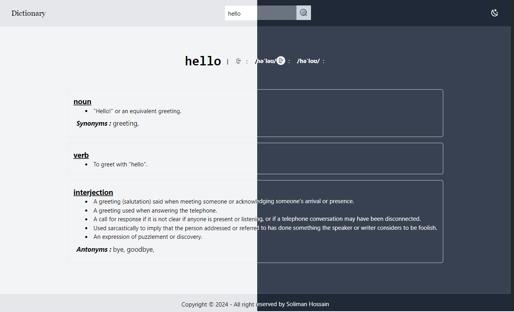

# Pratice Projects


### Weather Dashboard | [Code](/dashboard-weather) | [Preview](https://soliman-weather-dashboard.vercel.app/) |

```
cd dashboard-weather
npm install
npm run dev
```

---



### Dictionary App | [Code](/dictionary-app) | [Preview](https://dictionary-sol.pages.dev/) |

```
cd dictionary-app
npm install
npm run dev
```

---


### Dab Clone | [Code](/dab-clone) | [Preview](https://dab.pages.dev/) |

```
cd dab-colne
npm install
npm run dev
```

---


### Ihadis Bukhari | [Code](/ihadis-bukhari) | [Preview](https://ihadis-bukhari.vercel.app/) |

```
cd ihadis-bukhari
npm install
npm run dev
```

---

<br>

> These projects are done by [mine](https://github.com/solimanhossain/).
